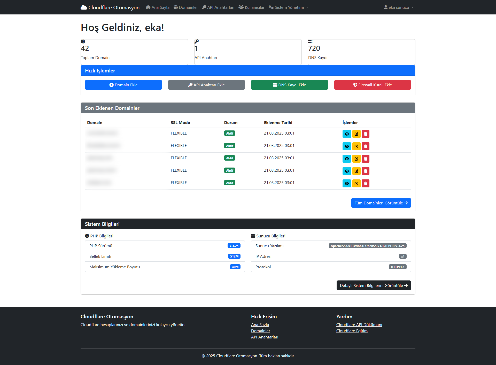
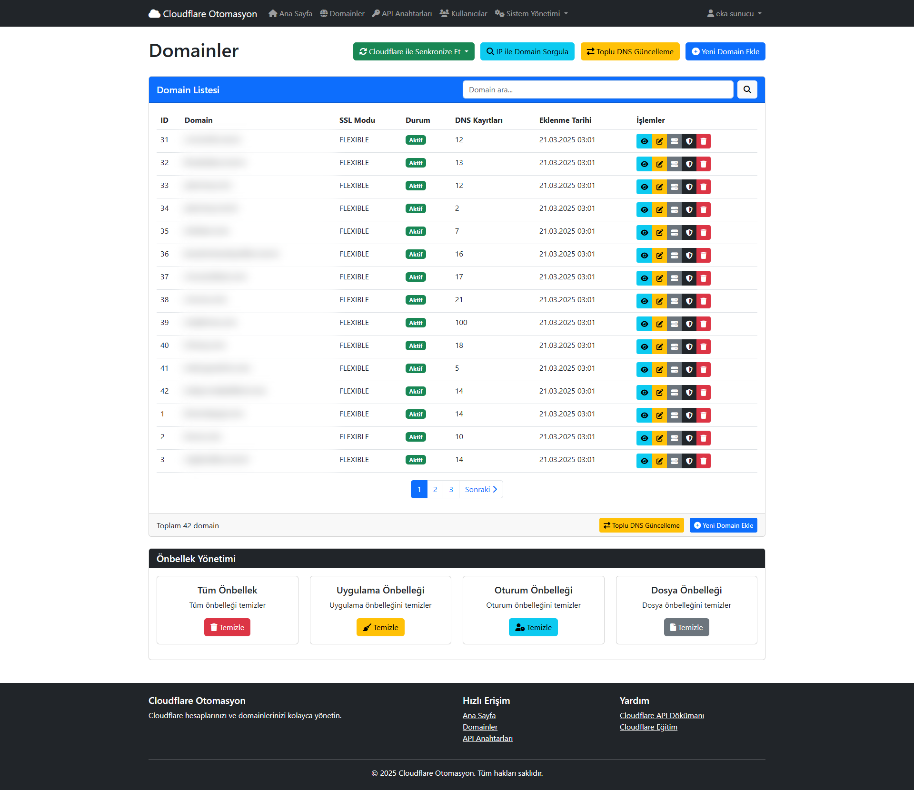
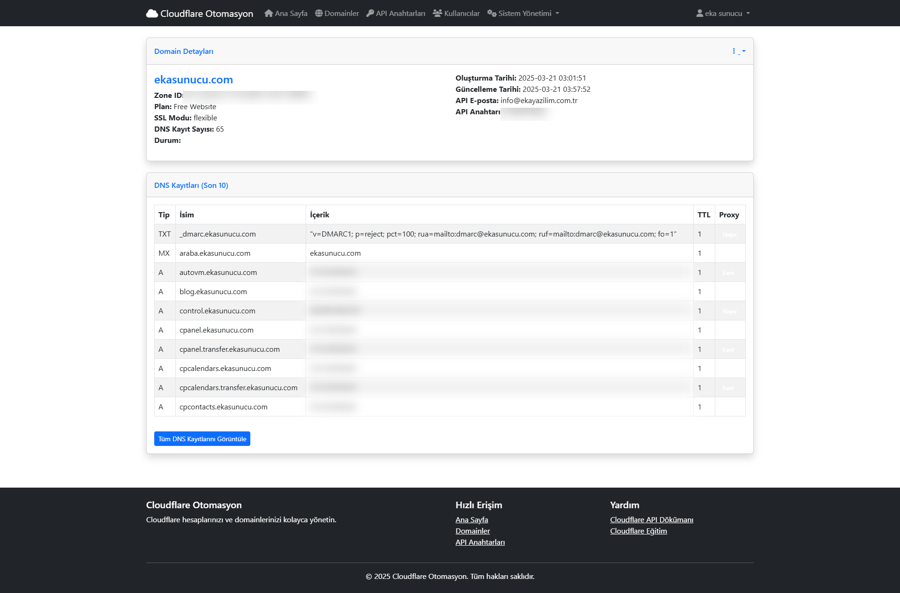
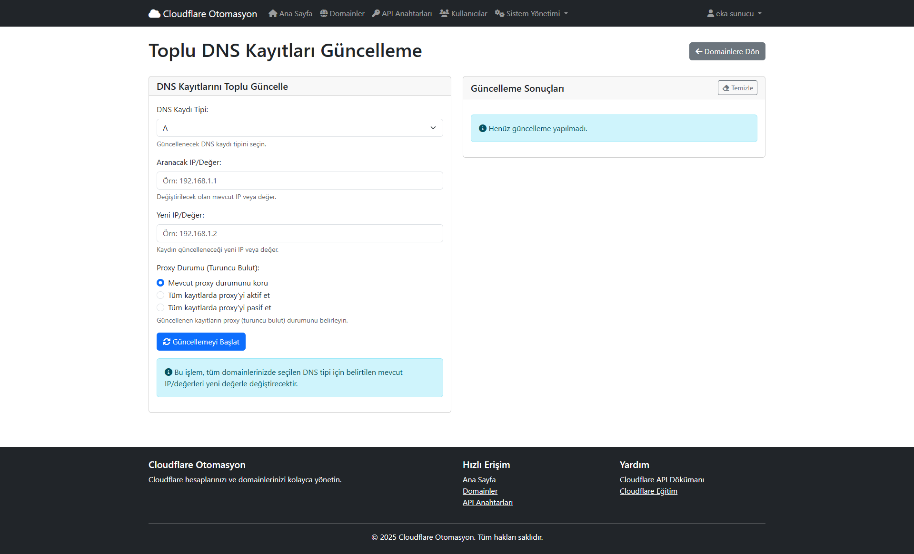

# Cloudflare Otomasyon Sistemi

Bu sistem, Cloudflare hesaplarını ve domain yönetimini otomatize etmek için geliştirilmiş bir web uygulamasıdır.

## Kurulum

### Veritabanı Kurulumu

#### Localhost (XAMPP)

1. XAMPP'ı açın ve MySQL servisini başlatın
2. phpMyAdmin'e giriş yapın (http://localhost/phpmyadmin)
3. Sol menüden "Yeni" butonuna tıklayarak yeni bir veritabanı oluşturun
4. Veritabanı adını belirleyin (örn. "cloudflare_otomasyon")
5. `veritabani.sql` dosyasını içeri aktarmak için:
   - İçe Aktar sekmesine tıklayın
   - Dosya Seç butonuyla `veritabani.sql` dosyasını seçin
   - Sağ alttaki "Git" butonuna tıklayın

#### cPanel

1. cPanel hesabınıza giriş yapın
2. Veritabanları bölümüne gidin (MySQL Veritabanları)
3. Yeni bir veritabanı oluşturun
4. Yeni bir veritabanı kullanıcısı oluşturun ve şifre belirleyin
5. Kullanıcıya veritabanı için tüm yetkileri verin
6. phpMyAdmin'e giriş yapın
7. Oluşturduğunuz veritabanını seçin
8. İçe Aktar sekmesinden `veritabani.sql` dosyasını yükleyin

#### Plesk

1. Plesk kontrol panelinize giriş yapın
2. Veritabanları bölümüne gidin
3. "Veritabanı Ekle" butonuna tıklayın
4. Veritabanı adını ve kullanıcı bilgilerini girin
5. phpMyAdmin'e tıklayarak veritabanı yönetim ekranına girin
6. İçe Aktar sekmesinden `veritabani.sql` dosyasını yükleyin

### Uygulama Ayarları

1. `/config/veritabani.php` dosyasını düzenleyerek veritabanı bağlantı bilgilerinizi güncelleyin
2. `/config/uygulama.php` dosyasında gerekli ayarlamaları yapın

## Kullanıcı Bilgileri

Varsayılan olarak aşağıdaki bilgilerle giriş yapabilirsiniz:

- **Kullanıcı adı:** admin
- **Şifre:** ekasunucu@gmail.com

## Yönetim Paneli

- Yönetim paneline `giris.php` sayfasından giriş yapabilirsiniz
- Yeni yönetici hesabı oluşturmak için:
  1. `kayit.php` sayfasından kayıt oluşturun
  2. Veritabanında `kullanicilar` tablosunda ilgili kullanıcının `yetki` alanını `admin` olarak güncelleyin

## Önemli Uyarılar

⚠️ **DİKKAT**:

- Bu sistem, Cloudflare API ile çalışmaktadır. Yapılan işlemler geri alınamaz.
- Yapılan işlemlerden ve oluşabilecek sorunlardan sistem geliştiricileri sorumlu değildir.
- Sistem üzerinden gerçekleştirilen tüm işlemlerin sorumluluğu kullanıcıya aittir.
- Kritik domain ve DNS ayarlarında değişiklik yapmadan önce yedek almanız tavsiye edilir.

## Teknik Gereksinimler

- PHP 7.4 veya üzeri
- MySQL 5.7 veya üzeri
- PDO PHP eklentisi
- cURL PHP eklentisi

## Özellikler

### Hesap Yönetimi
- Birden fazla Cloudflare API anahtarı ekleme ve yönetme
- Kullanıcı bazlı yetkilendirme ve oturum yönetimi
- Yönetici ve normal kullanıcı ayrımı

### Domain Yönetimi
- Birden fazla domaini tek bir panelden yönetme
- Cloudflare ile otomatik senkronizasyon
- Domain ekle, sil, düzenle işlemleri
- SSL modu (Flexible, Full, Full Strict) ayarlama
- Plan bilgisi görüntüleme

### DNS Yönetimi
- Tüm DNS kayıtlarını görüntüleme ve düzenleme (A, AAAA, CNAME, MX, TXT, SRV)
- DNS kayıtlarını toplu olarak güncelleme
  - Belirli bir IP'yi içeren tüm kayıtları toplu değiştirme
  - Proxy durumunu toplu güncelleme (aktif/pasif)
- IP adresine göre domain sorgulama
- DNS önbelleğini temizleme

### Firewall Yönetimi
- Firewall kuralları oluşturma ve yönetme
- IP engelleme, aksiyon belirleme
- Firewall kurallarını düzenleme

### Öne Çıkan Özellikler
- **Toplu DNS Güncelleme**: Tüm domainlerdeki belirli bir IP adresini başka bir IP adresi ile değiştirme
- **IP Tabanlı Domain Sorgulama**: Belirli bir IP'yi kullanan tüm domainleri listeleme
- **Proxy Yönetimi**: DNS kayıtları için proxy durumunu (turuncu bulut) toplu olarak yönetme
- **Gerçek Zamanlı Loglama**: Tüm işlemlerin detaylı log kayıtları

### Kullanıcı Arayüzü
- Responsive modern tasarım
- Bootstrap tabanlı arayüz
- Toplu işlemler için bildirim sistemi
- AJAX tabanlı gerçek zamanlı güncelleme

### Teknik Özellikler
- PHP 7+ tabanlı nesne yönelimli mimari
- PDO ile veritabanı işlemleri
- Cloudflare API v4 entegrasyonu
- Oturum yönetimi ve güvenlik kontrolleri
- Temiz kod mimarisi

## Ekran Görüntüleri

*Dashboard Ekranı*

*Domain Yönetimi*

*DNS Kayıtları Yönetimi*

*Toplu DNS Kayıtları Güncelleme*

## Lisans

Bu proje MIT lisansı altında lisanslanmıştır. Daha fazla bilgi için [LICENSE](LICENSE) dosyasına bakınız.

## İletişim

Herhangi bir soru, öneri veya geri bildiriminiz varsa lütfen issue açarak veya aşağıdaki iletişim bilgileri üzerinden bize ulaşın:

- E-posta: info@ekayazilim.com.tr
- Web: [www.ekayazilim.com.tr](https://www.ekayazilim.com.tr)
- 🌐 [ekasunucu.com](https://www.ekasunucu.com)
## Katkıda Bulunma

Projeye katkıda bulunmak için lütfen fork edin ve pull request gönderin. Önerilerinizi ve geri bildirimlerinizi her zaman bekliyoruz. 
